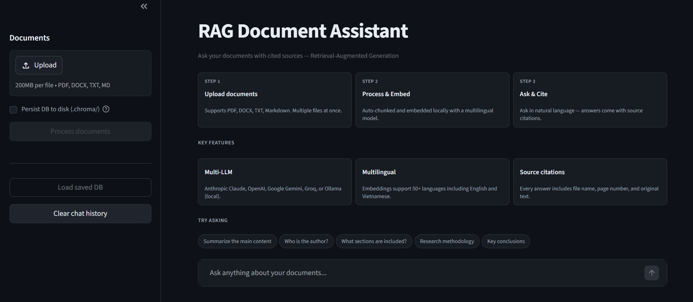
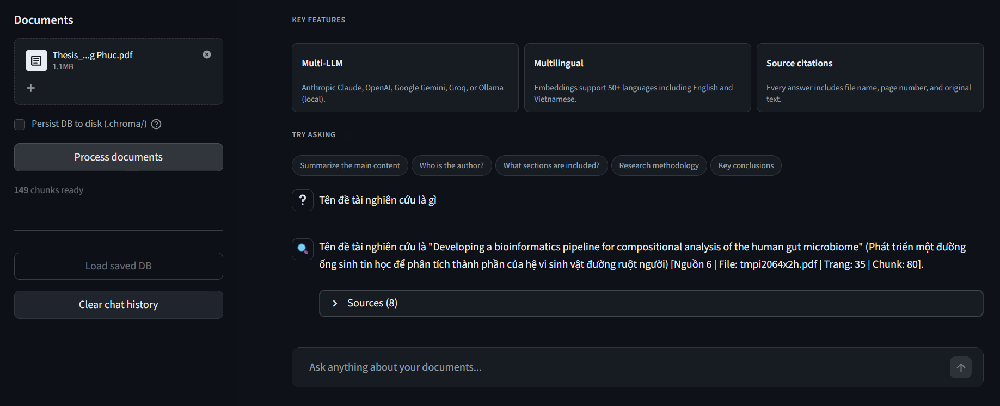

# RAG Document Assistant

> Chat with your documents — natural-language Q&A over PDF, DOCX, TXT, and Markdown files using Retrieval-Augmented Generation.


<p align="center">
  
</p>

> [!NOTE]
> Deployment testing

<p align="center">
  
</p>

---

## Table of contents

- [Overview](#overview)
- [Features](#features)
- [Architecture](#architecture)
- [Tech Stack](#tech-stack)
- [Project structure](#project-structure)
- [Requirements](#requirements)
- [Installation](#installation)
- [Configuration](#configuration)
- [Running the app](#running-the-app)
  - [Streamlit UI](#1-streamlit-ui-chat-interface)
  - [FastAPI Backend](#2-fastapi-backend-rest-api)
  - [Docker Compose](#3-docker-compose-full-stack)
- [API Reference](#api-reference)
- [Testing](#testing)
- [Quality evaluation (RAGAS)](#quality-evaluation-ragas)
- [Troubleshooting](#troubleshooting)
- [Roadmap](#roadmap)
- [License](#license)

---

## Overview

**RAG Document Assistant** is a web application that lets you upload documents and ask questions in natural language. The system:

1. Splits documents into chunks
2. Converts chunks into vector embeddings
3. Stores vectors in ChromaDB
4. On each question → retrieves the most relevant chunks → sends them to an LLM (Claude / GPT / Gemini / Llama / Ollama) → returns an answer with source citations

### Why this project is useful

- Fast Q&A over long documents (reports, books, lecture notes)
- Every answer comes with **source citations** (file name, page number)
- Fully local execution with Ollama (free, no API key required)
- A standard RAG architecture — great as an AI Engineer portfolio piece

---

## Features

- Multi-format support: **PDF, DOCX, TXT, Markdown**
- Streamlit chat UI — upload multiple files at once
- FastAPI REST API — auto-generated Swagger docs at `/docs`
- Multi-provider LLM: **Anthropic Claude**, **OpenAI GPT**, **Google Gemini**, **Groq**, **Ollama** (local)
- Local embedding model, free (`all-MiniLM-L6-v2` or multilingual)
- Detailed source citations (file, page, chunk index)
- Conversation memory for multi-turn Q&A
- Evaluation pipeline with RAGAS
- Docker-ready with docker-compose

---

## Architecture

```
                              RAG Pipeline

  ┌──────────┐    ┌───────────┐    ┌────────────┐    ┌────────────┐
  │ Document │───>│ Chunking  │───>│ Embedding  │───>│ Vector DB  │
  │ Upload   │    │ (Split +  │    │ (MiniLM    │    │ (ChromaDB) │
  │          │    │  Overlap) │    │  L6-v2)    │    │            │
  └──────────┘    └───────────┘    └────────────┘    └─────┬──────┘
                                                           │
                                                           │ top-k
  ┌──────────┐    ┌───────────┐    ┌────────────┐          │
  │ Response │<───│    LLM    │<───│  Retrieval │<─────────┘
  │ + Source │    │ (Claude/  │    │ (Similarity│<─── User Query
  │ Citation │    │ GPT/Llama)│    │  Search)   │
  └──────────┘    └───────────┘    └────────────┘
```

### Detailed data flow

1. **Ingestion** — [src/ingestion/loader.py](src/ingestion/loader.py) loads files via LangChain loaders.
2. **Chunking** — [src/ingestion/chunker.py](src/ingestion/chunker.py) splits text using `RecursiveCharacterTextSplitter` (1000 characters per chunk, 200 overlap).
3. **Embedding** — [src/embeddings/store.py](src/embeddings/store.py) uses a HuggingFace model to produce a 384-dim vector per chunk.
4. **Retrieval** — [src/retrieval/retriever.py](src/retrieval/retriever.py) returns the top-k closest chunks (cosine similarity).
5. **Generation** — [src/generation/rag_chain.py](src/generation/rag_chain.py) builds the LangChain pipeline: `query → retrieve → format context → LLM → answer`.

---

## Tech Stack

| Component   | Technology                              | Notes                                  |
| ----------- | --------------------------------------- | -------------------------------------- |
| Framework   | LangChain 0.3+                          | RAG orchestration                      |
| Vector DB   | ChromaDB                                | Local embedding store                  |
| LLM         | Claude / GPT / Gemini / Groq / Ollama   | Switch via `LLM_PROVIDER`              |
| Embedding   | `all-MiniLM-L6-v2`                      | HuggingFace — runs locally, free       |
| Backend     | FastAPI + Uvicorn                       | REST API with auto-generated docs      |
| Frontend    | Streamlit                               | Quick chat UI                          |
| Container   | Docker + Docker Compose                 | Easy deployment                        |
| Evaluation  | RAGAS                                   | Faithfulness, relevancy, precision     |

---

## Project structure

```
rag-document-assistant/
├── src/
│   ├── ingestion/
│   │   ├── loader.py          # Loads PDF, DOCX, TXT, MD
│   │   └── chunker.py         # Splits text into overlapping chunks
│   ├── embeddings/
│   │   └── store.py           # Embedding + ChromaDB
│   ├── retrieval/
│   │   └── retriever.py       # Vector similarity search
│   ├── generation/
│   │   ├── rag_chain.py       # Core RAG chain
│   │   └── memory.py          # Conversation memory
│   └── api/
│       └── routes.py          # FastAPI endpoints
├── app/
│   └── main.py                # Streamlit UI
├── tests/
│   ├── test_loader.py
│   ├── test_chunker.py
│   ├── test_store.py
│   ├── test_rag_chain.py
│   └── test_evaluation.py     # RAGAS evaluation
├── data/
│   ├── samples/               # Sample documents
│   └── uploads/               # Runtime upload directory
├── conftest.py                # Pytest config
├── run_api.py                 # FastAPI entry point
├── Dockerfile
├── docker-compose.yml
├── pyproject.toml
├── .env.example
└── README.md
```

---

## Requirements

- **Python** >= 3.11
- **pip** >= 23
- (Recommended) **Git** to clone the repo
- (Optional) **Docker** >= 24 + **Docker Compose** >= 2
- **RAM**: 4 GB minimum (embedding model ~90 MB)
- **Disk**: ~2 GB for dependencies and model cache
- **API key**: Anthropic / OpenAI / Gemini / Groq (or install Ollama for a 100% free local run)

---

## Installation

### Step 1 — Clone the repository

```bash
git clone <your-repo-url> rag-document-assistant
cd rag-document-assistant
```

### Step 2 — Create a virtual environment

**Windows — CMD (Command Prompt):**
```cmd
python -m venv .venv
.venv\Scripts\activate.bat
```

**Windows — PowerShell:**
```powershell
python -m venv .venv
.venv\Scripts\Activate.ps1
```

> If PowerShell complains about the execution policy, run:
> `Set-ExecutionPolicy -Scope CurrentUser -ExecutionPolicy RemoteSigned`

**Windows — Git Bash:**
```bash
python -m venv .venv
source .venv/Scripts/activate
```

**macOS / Linux:**
```bash
python -m venv .venv
source .venv/bin/activate
```

### Step 3 — Install dependencies

**Full install (dev + eval):**
```bash
pip install -e ".[dev,eval]"
```

**Minimal install to run the app:**
```bash
pip install -e .
```

**Optional providers:**
```bash
pip install -e ".[gemini]"    # Google Gemini
pip install -e ".[groq]"      # Groq
pip install -e ".[openai]"    # OpenAI
pip install -e ".[ollama]"    # Ollama
pip install -e ".[all-providers]"  # all of the above
```

### Step 4 — Pre-download the embedding model (optional)

Avoid the wait on first run:
```bash
python -c "from sentence_transformers import SentenceTransformer; SentenceTransformer('all-MiniLM-L6-v2')"
```

---

## Configuration

### Create a `.env` file

**Windows CMD:**
```cmd
copy .env.example .env
```

**PowerShell:**
```powershell
Copy-Item .env.example .env
```

**Git Bash / macOS / Linux:**
```bash
cp .env.example .env
```

> Note: `.env.example` is a **dot-file** and may be hidden in File Explorer.
> Enable it via **View → Show → Hidden items** (VS Code shows it by default).

### Quick provider comparison

| Provider      | Free?                                | Speed                  | Quality | Recommended for     |
| ------------- | ------------------------------------ | ---------------------- | ------- | ------------------- |
| **Gemini**    | ✅ Free tier (15 req/min, 1500/day)   | Fast                   | ⭐⭐⭐⭐    | **Learning, demos** |
| **Groq**      | ✅ Very generous free tier            | **Extremely fast** (>500 t/s) | ⭐⭐⭐⭐ | **Realtime demos** |
| **Anthropic** | ❌ Pay-as-you-go (~$5 min top-up)     | Fast                   | ⭐⭐⭐⭐⭐  | Production          |
| **OpenAI**    | ❌ Pay-as-you-go                      | Fast                   | ⭐⭐⭐⭐⭐  | Production          |
| **Ollama**    | ✅ 100% free (local)                  | Slow on CPU            | ⭐⭐⭐    | Privacy / offline   |

### Configure `.env` per provider

#### Option A — Google Gemini (FREE, recommended for learning)

1. Get the API key (free, requires a Google account):
   https://aistudio.google.com/apikey
2. Install the adapter:
   ```cmd
   pip install -e ".[gemini]"
   ```
3. Set in `.env`:
   ```env
   LLM_PROVIDER=gemini
   GOOGLE_API_KEY=AIza...your-key...
   ```

**Free tier limits:**
- 15 requests/minute
- 1,500 requests/day
- 1M tokens/minute

**Default model**: `gemini-2.0-flash`. Use `LLM_MODEL=gemini-1.5-flash` for a more stable variant.

#### Option B — Groq (FREE, fastest)

Groq uses LPU chips with extremely high inference speed (>500 tokens/sec).

1. Get the API key:
   https://console.groq.com/keys
2. Install the adapter:
   ```cmd
   pip install -e ".[groq]"
   ```
3. Set in `.env`:
   ```env
   LLM_PROVIDER=groq
   GROQ_API_KEY=gsk_...your-key...
   ```

**Free tier limits** (per model, generous):
- 30 requests/minute
- 14,400 requests/day

**Default model**: `llama-3.3-70b-versatile`. Other options:
- `llama-3.1-8b-instant` — fastest
- `mixtral-8x7b-32768` — 32K context
- `gemma2-9b-it` — Google open model

Switch via `LLM_MODEL`:
```env
LLM_MODEL=llama-3.1-8b-instant
```

#### Option C — Anthropic Claude (PAID, highest quality)

```env
LLM_PROVIDER=anthropic
ANTHROPIC_API_KEY=sk-ant-...your-key...
```

Get the key: https://console.anthropic.com/ (requires a $5 minimum top-up)

#### Option D — OpenAI GPT (PAID)

```cmd
pip install -e ".[openai]"
```

```env
LLM_PROVIDER=openai
OPENAI_API_KEY=sk-...your-key...
```

Default model: `gpt-4o-mini` (cheapest). Use `LLM_MODEL=gpt-4o` for better quality.

#### Option E — Ollama (LOCAL, free but resource-heavy)

1. Install Ollama: https://ollama.com/download
2. Pull a model (based on your available RAM):
   ```cmd
   ollama pull gemma2:2b      :: 8 GB RAM
   ollama pull llama3         :: 16 GB RAM
   ```
3. Install the adapter:
   ```cmd
   pip install -e ".[ollama]"
   ```
4. Set in `.env`:
   ```env
   LLM_PROVIDER=ollama
   LLM_MODEL=gemma2:2b
   ```

### Install all providers at once

```cmd
pip install -e ".[all-providers]"
```

### Other environment variables

| Variable                 | Default            | Description                                                  |
| ------------------------ | ------------------ | ------------------------------------------------------------ |
| `LLM_PROVIDER`           | `anthropic`        | `anthropic` / `openai` / `gemini` / `groq` / `ollama`        |
| `LLM_MODEL`              | (per provider)     | Override the provider's default model                        |
| `EMBEDDING_MODEL`        | `all-MiniLM-L6-v2` | HuggingFace embedding model                                  |
| `CHROMA_PERSIST`         | `true`             | `true` = save to disk; `false` = in-memory only              |
| `CHROMA_PERSIST_DIR`     | `.chroma`          | Directory to persist ChromaDB                                |
| `CHROMA_COLLECTION_NAME` | `documents`        | ChromaDB collection name                                     |

---

## Running the app

### 1. Streamlit UI (chat interface)

```bash
streamlit run app/main.py
```

Open the browser at http://localhost:8501

**How to use:**
1. Upload files (PDF / DOCX / TXT / MD) in the sidebar
2. Click **"Process documents"**
3. Type your question in the chat input
4. Read the answer and inspect the citations in the "Sources" expander

### 2. FastAPI Backend (REST API)

**Option 1 — entry script:**
```bash
python run_api.py
```

**Option 2 — uvicorn directly:**
```bash
uvicorn src.api.routes:app --reload --host 0.0.0.0 --port 8000
```

- API docs (Swagger): http://localhost:8000/docs
- API docs (ReDoc): http://localhost:8000/redoc
- Health check: http://localhost:8000/health

### 3. Docker Compose (full stack)

```bash
docker compose up --build
```

- Streamlit: http://localhost:8501
- FastAPI: http://localhost:8000

**Stop services:**
```bash
docker compose down
```

**Wipe data (including ChromaDB):**
```bash
docker compose down -v
```

---

## API Reference

### `POST /upload`

Upload and process a document.

**Request:**
```bash
curl -X POST http://localhost:8000/upload \
  -F "file=@path/to/document.pdf"
```

**Response:**
```json
{
  "message": "Processed 42 chunks from document.pdf"
}
```

### `POST /ask`

Ask a question about previously uploaded documents.

**Request:**
```bash
curl -X POST http://localhost:8000/ask \
  -H "Content-Type: application/json" \
  -d '{"question": "Summarize the main content", "k": 4}'
```

**Response:**
```json
{
  "answer": "The document discusses...",
  "sources": [
    {
      "file": "document.pdf",
      "page": 3,
      "content_preview": "..."
    }
  ]
}
```

### `GET /health`

Health check endpoint.

**Response:**
```json
{ "status": "ok" }
```

---

## Testing

### Run all tests

```bash
pytest tests/ -v
```

### Run with coverage report

```bash
pytest tests/ -v --cov=src --cov-report=term-missing --cov-report=html
```

Open `htmlcov/index.html` for the detailed report.

### Run specific tests

```bash
pytest tests/test_loader.py -v                                # only loader tests
pytest tests/test_chunker.py::test_chunk_long_document -v     # a single test
```

### Linting & formatting

```bash
ruff check .
black --check .
black .    # auto-format
```

---

## Quality evaluation (RAGAS)

After installing the `eval` extra:
```bash
pip install -e ".[eval]"
```

Run the evaluation:

```python
from src.embeddings.store import load_vector_store
from tests.test_evaluation import evaluate_rag

store = load_vector_store()

questions = ["Question 1?", "Question 2?"]
ground_truths = ["Expected answer 1", "Expected answer 2"]

results = evaluate_rag(questions, ground_truths, store)
print(results)
```

Metrics:
- **Faithfulness** — does the answer stick to the retrieved context?
- **Answer Relevancy** — is the answer focused on the question?
- **Context Precision** — does retrieval return the right chunks?

---

## Troubleshooting

### 1. `ImportError: No module named 'src'`

Run commands from the **project root**:
```bash
cd rag-document-assistant
streamlit run app/main.py    # not from inside app/
```

### 2. `ANTHROPIC_API_KEY not set`

Check the `.env` file:
```bash
cat .env
# LLM_PROVIDER=anthropic
# ANTHROPIC_API_KEY=sk-ant-...
```

### 3. PDF with bad OCR returns nothing

Use a text-based PDF rather than a scanned one. For scanned PDFs you'll need to add an OCR step (e.g., Tesseract).

### 4. First-run embedding model download is slow

The first run pulls ~90 MB. Subsequent runs reuse the cache at `~/.cache/huggingface/`.

### 5. Docker build is slow

Enable BuildKit to leverage layer caching:
```bash
DOCKER_BUILDKIT=1 docker compose build
```

### 6. ChromaDB lock error

If you hit a ChromaDB lock, delete `.chroma/` and re-upload:
```bash
rm -rf .chroma
```

### 7. Vietnamese (or other non-English) docs give poor answers

The default embedding model `all-MiniLM-L6-v2` is English-only. Switch to a multilingual model in `.env`:
```env
EMBEDDING_MODEL=paraphrase-multilingual-MiniLM-L12-v2
```
Then delete `.chroma/` and re-process your documents.

### 8. LangChain deprecation warnings

Warnings from `langchain_community` do not affect functionality. Migration to the new packages (`langchain-chroma`, `langchain-huggingface`, `langchain-text-splitters`) is already underway in this project.

---

## Roadmap

- [x] Multi-format document loading (PDF, DOCX, TXT, MD)
- [x] RAG pipeline with citation tracking
- [x] Streamlit UI
- [x] FastAPI backend
- [x] Docker containerization
- [x] Unit tests
- [x] Multilingual embedding support
- [ ] Hybrid search (BM25 + vector)
- [ ] Re-ranking with Cohere / Cross-encoder
- [ ] Streaming responses
- [ ] Multi-user with authentication
- [ ] Deploy to HuggingFace Spaces / Railway

---

## License

MIT License — see [LICENSE](LICENSE) for details.

---

## Further reading

- [LangChain Documentation](https://python.langchain.com/docs/)
- [ChromaDB Guide](https://docs.trychroma.com/)
- [RAGAS Evaluation](https://docs.ragas.io/)
- [Streamlit Docs](https://docs.streamlit.io/)
- [Anthropic Claude API](https://docs.anthropic.com/)
- [Google Gemini API](https://ai.google.dev/gemini-api/docs)
- [Groq API](https://console.groq.com/docs)
